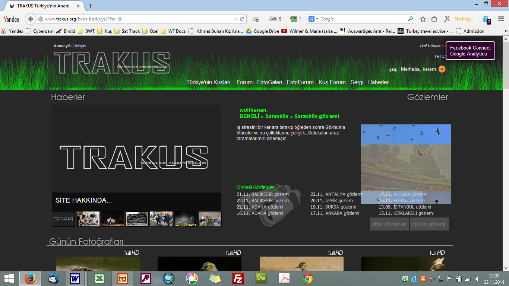

# Önsöz {.unnumbered}

Bu kitap ilk aşamada dijital formatta yayımlanmıştır. Basılı bir yayın yerine açık erişimli dijital bir formatın tercih edilmesinin nedenleri vardır.

Dijital kitaplar ücretsizdir ve kolaylıkla erişilebilir. Tablet, bilgisayar ya da cep telefonu gibi farklı cihazlarda rahatlıkla okunabilir. Ornitoloji gibi sürekli değişen ve gelişen bir alanda, basılı kitaplar daha yayımlandıkları anda güncelliğini yitirebilir. Oysa dijital kitaplarda tür listeleri, yayılış haritaları ve mevcut durum bilgileri hızla güncellenebilir. Ayrıca dijital yayınlar, daha katılımcı bir süreçle geliştirilebilir. Kuş gözlemcileri, uzmanlar ve akademisyenler GitHub üzerinden metni doğrudan düzenleyebilirler.

## Kitabın Tarihçesi

Türkiye'nin yabani kuş türlerine dair bugüne kadar hazırlanmış en kapsamlı kaynak olan *The Birds of Turkey* 2008 yılında İngilizce olarak yayımlandı [@kirwanetal2008]. Yazarlarından biri olarak, kitabın yayımlanmasının hemen ardından kitabın Türkçesinin mutlaka olması gerektiği fikriyle harekete geçtim. Cavit Bilen'in desteği ile "The Birds of Turkey" kitabının telif hakları alındı ve 2013 yılında, İngilizceye hâkim kuş gözlemcilerinden oluşan bir ekiple metnin taslak çevirileri tamamlandı. Diğer yandan, kitapla ilgilenen yayınevi yayın politikasını değiştirerek bu tür kitapları basmama kararı aldı. Sonuçta kitapla ilgili çalışmalar da yarıda kaldı.

Çevirisi tamamlanan metinler incelendiğinde, kitabın yalnızca dil yönünden değil, içerik açısından da kapsamlı bir revizyona ihtiyaç duyduğu ortaya çıktı. Bu nedenle, yazarların da rızasıyla proje bir çeviri çalışmasından özgün bir kitap projesine dönüştü. Başlangıçta hedeflenen çevirinin ötesine geçilerek metinler yeniden yazıldı; mevcut durum paragrafları güncellendi, bazı taksonomik tartışmalar çıkarıldı ve üreme biyolojisi bölümleri sadeleştirildi. 2008’de yayımlanan orijinal kitaptan bu yana geçen sürede Türkiye kuş faunasında yaşanan değişiklikler ve yeni gözlemler, metinlere ve haritalara dahil edildi. Türkiye kapsamı dışındaki bilimsel içerikler çıkarıldı; haritalar renklendirildi ve okuyucu dostu unsurlarla zenginleştirildi. Böylece, başlangıçta bir çeviri olarak tasarlanan çalışma, özgün içeriğe sahip yeni bir kitaba dönüştü.

Uzun bir duraklama döneminin ardından, 2016 yılında yeniden harekete geçtim ve İş Bankası Yayınları ile bir sözleşme imzalayarak editör Cumhur Öztürk ile çalışmalara başladım. Doğa tarihi konusunda deneyimli bir editör olan Cumhur ile metinler bir kez daha gözden geçirildi ve kitabın ilk maketi hazırlandı. Ancak bu süreçte, Türkiye’de yaşanan gelişmeler ve kişisel nedenlerle bu büyük projeye tekrar odaklanmakta güçlük çektim. 2021’e kadar süren bu duraklamanın ardından, artan kâğıt maliyetleri ve kitabın 500 sayfayı aşan hacmi nedeniyle yayımlama sürecinden karşılıklı olarak vazgeçildi.

Sonunda teknolojik gelişmeler imdadıma yetişti. Veri bilimiyle ilgili bazı kitaplardan etkilenerek, RStudio tarafından geliştirilen Quarto yayıncılık sistemini öğrendim. Elimdeki metinleri Markdown formatında yeniden düzenledim. Quarto sayesinde dizgi ve tasarımla ilgili tüm sorunlar ortadan kalktı; kaynakça yönetimi ise çok pratik ve hızlı bir hâle geldi.

Editör Cumhur Öztürk ile üzerinde uzlaştığımız düzeltmeler ve metnin yeniden biçimlendirilmesi konusunda yapay zekâyı yönlendirdim; özellikle üreme paragraflarını sistemli bir şekilde yeniden organize ettim. Yine yapay zekâ desteğiyle, tüm metni dilbilgisi ve yazım kuralları açısından uyumlu hale getirip daha akıcı ve anlaşılır bir dile kavuşturdum. Ekim 2024 ile Mayıs 2025 arasında yoğun bir çalışma sürecine girdim. Kitabı fasiküller hâlinde yayımlamaya karar verdim. İlk üç fasikül Ekim 2024’te çevrimiçi olarak yayımlandı. Kitabın tamamı ise Mayıs 2025’e kadar tamamlandı.

Kitabın içeriğini GitHub platformu üzerinden yayımlayarak, GitHub Pages (github.io) altyapısıyla çevrimiçi olarak herkesin erişimine açtım.

Kuşlar hakkındaki bir kitap fotoğrafsız olamazdı! Her türe eBird Macaulay Library’nin görsel–işitsel arşivinden yüksek kaliteli fotoğraflar widget formatında eklendiKitabın Hazırlanması\*\*

Bu yazarların çalışmaları, müze örnekleri, kendi arazi gözlemlerimiz ve diğer otoritelerin değerlendirmeleriyle karşılaştırılarak yeniden gözden geçirilmiştir.

## Metinlerin Yazılması

Bu kitaptaki metinler ilk aşamada İngilizce olarak, aşağıdaki yazarlar tarafından hazırlanmıştır. Bu metinlerin büyük çoğunluğu Guy Kirwan tarafından yazılmıştır. Diğer metinleri hazırlayan yazarlar şu şekildedir:

Barbaros Demirci: *Poyrazkuşu, Uzunbacak, Kılıçgaga, Kocagöz, Halkalı Küçük Cılıbıt, Halkalı Cılıbıt, Akça Cılıbıt, Büyük Cılıbıt, Altın Yağmurcun, Yağmurcun, Mahmuzlu Kızkuşu, Kızkuşu, Ak Kumkuşu, Küçük Kumkuşu, Sarı Bacaklı Kumkuşu, Kızıl Kumkuşu, Kara Karınlı Kumkuşu, Dövüşkenkuş, Küçük Suçulluğu, Suçulluğu, Çulluk, Çamurçulluğu, Kervançulluğu, Kara Kızılbacak, Kızılbacak, Bataklık Düdükçünü, Yeşilbacak, Yeşil Düdükçün, Orman Düdükçünü, Çizgili İshakkuşu, İshakkuşu, Puhu, Kumkuşu, Alaca Baykuş, Kulaklı Orman Baykuşu, Kır Baykuşu.*

Metehan Özen: *Kaya Güvercini, Gökçe Güvercin, Tahtalı, Kumru, Üveyik, Küçük Kumru, Tepeli Guguk, Guguk, Çobanaldatan, Çıtkuşu, Dağbülbülü, Büyük Dağbülbülü, Çalı Bülbülü, Kızılgerdan, Benekli Bülbül, Bülbül, Mavigerdan, Kara Kızılkuyruk, Kızılkuyruk, Çayır Taşkuşu, Taşkuşu, Sibirya Taşkuşu, Kuyrukkakan, Alaca Kuyrukkakan, Kıbrıs Kuyrukkakanı, Kara Kulaklı Kuyrukkakan, Kızılca Kuyrukkakan, Taşkızılı, Gökardıç, Boğmaklı Ardıç, Karatavuk, Tarla Ardıcı, Öter Ardıç, Kızıl Ardıç, Ökse Ardıcı, Benekli Sinekkapan, Kayın Baştankarası, Ak Yanaklı Baştankara, Çam Baştankarası, Mavi Baştankara, Büyük Baştankara, Orman Tırmaşıkkuşu, Bahçe Tırmaşıkkuşu, Çulhakuşu, Sarıasma.*

Tim Marlow: *Benekli Suyelvesi, Bataklık Suyelvesi, Küçük Suyelvesi, Bıldırcınkılavuzu, Sutavuğu, Sakarmeke, Turna, Büyük Karabaş Martı, Akdeniz Martısı, Küçük Martı, Karabaş Martı, İnce Gagalı Martı, Küçük Gümüş Martı, Kara Sırtlı Martı, Gülen Sumru, Hazar Sumrusu, Kara Gagalı Sumru, Sumru, Küçük Sumru, Bıyıklı Sumru, Kara Sumru, Bağırtlak, Kılkuyruk Bağırtlak, Derekuşu, Sürmeli Dağbülbülü, Taş Bülbülü, Boz Kuyrukkakan, Ak Sırtlı Kuyrukkakan, Küçük Sinekkapan, Alaca Sinekkapan, Halkalı Sinekkapan, Kara Sinekkapan, Bıyıklı Baştankara, Uzun Kuyruklu Baştankara, Anadolu Sıvacısı, Sıvacı, Kaya Sıvacısı, Büyük Kaya Sıvacısı, Duvar Tırmaşıkkuşu.*

Güven Eken *Keklik, Çil Keklik, Bıldırcın ve Saz Delicesi* metinlerini hazırlayarak katkı vermiştir.

Türkçeye Çevrilmesi ve Uyarlanması

Metinlerdeki bilgi akışı yeniden düzenlenmiş, bilgi sıralaması sıradan bir gözlemcinin anlayışına göre şekillendirilmiştir. Çok uzman kullanıcıların ilgisini çekebilecek özel bilgiler – örneğin çok yaygın bir türün Doğu Karadeniz’de bulunmadığı gibi ayrıntılar – genel giriş paragrafından sonra, metnin ilerleyen bölümlerine yerleştirilmiştir. Benzer şekilde, tartışmalı ya da karmaşık konular sadeleştirilmiş, ana fikir ön plana çıkarılmıştır. Bu sayede genel okuyucunun metindeki temel mesajı kolayca kavraması hedeflenmiştir.

Metinler en güncel bilgilerle güncellenmiştir. Son yayın 2008 yılında yapıldığı için, metinlerin çoğu 2000’li yıllarda tamamlanmıştır. Arada geçen 25 yılda kuşlar hakkında bildiklerimiz son derece artmıştır. Nadir türlerin kayıtları gelmeye ve sağlıklı şekilde teyit edilmeye devam etmektedir. Yaygın türler için de daha önce bilinmeyen alanlardan gözlem ve üreme kayıtları elde edilmiştir.

# Teşekkürler {.unnumbered}

Bu kitabın oluşumuna çok sayıda kişinin emeği, bilgisi ve desteği yansıdı. Adını andığım ya da anmadığım herkese çok teşekkür ederim.

Projenin en başından beri hem destek veren hem de ilham kaynağı olan Guy Kirwan, çalışmanın şekillenmesinde önemli bir rol oynadı. "The Birds of Turkey" kitabının yazarları Guy Kirwan, Peter Castell, Barbaros Demirci, Metehan Özen, Hilary Welch ve Tim Marlow, bu yeni çalışmada da katkılarını sürdürdüler.

Özge Keşaplı Can, Özgür Keşaplı, Ömer Döndüren, artık aramızda olmayan Önder Cirik, Utku Perktaş ve Kuzey Cem Kulaçoğlu, ilk çevirileri hazırladı. Giriş bölümünün çevirilerini Bahtiyar Kurt ve Sancar Barış üstlendi.

Metinlerin bilimsel doğruluğunu artıran tür uzmanları Dilek Şahin (yelkovanlar), Orhan Gül ve Ortaç Onmuş (pelikanlar) ile Özge Balkız (flamingolar), metinleri dikkatle gözden geçirdiler. Emrah Çoraman, Kiraz Erciyas Yavuz ve Ömral Ünsal Özkoç, kitabın görsel açıdan zenginleştirilmesi konusunda öneriler sundular.

Ali Atahan, Nizamettin Yavuz, Mustafa Kiraz Erciyas Yavuz ve Metehan Özen, ilk aşamalarda nadir tür kayıtlarını derlediler. Sonraki yıllarda Türkiye Kuş Kayıt Komitesi ve eBird hakem heyeti üyeleri bu süreci sistematik biçimde sürdürdü.

Yayın sürecinde, Cavit Bilen en başından itibaren her aşamada destek verdi. Hülya Tokmak ve Ahmet Boratav, kitabın ilk maketinin hazırlanmasına katkıda bulundular. NTV Yayınları’nın kurucu editörü Mustafa Dağıstanlı, çalışmayı sahiplenerek ilk aşamalarda önemli bir motivasyon kaynağı oldu. Grafik tasarımcı Budak Akalın özellikle haritaların hazırlanmasında teknik destek verdi. Kemal Nuraydın, Oya Ayman ve Nesibe Bat, içerik akışının planlanmasına katkıda bulundular.

Yayının son aşamalarında İş Bankası Yayınları’ndan editör Cumhur Öztürk, metinlerin son hâline ulaşmasında belirleyici katkı sundu.

Türkiye’nin dört bir yanından Kuşbank’a gözlem verilerini ulaştıran tüm gözlemciler, bu kitabın bilgi temellerini oluşturdu. 2015’te Kuşbank’ın eBird’e taşınmasının ardından, eBird’e kayıt giren ve görsel yükleyen binlerce kuş gözlemcisi veri akışını sürdürerek bu çalışmanın en önemli bilgi kaynağı hâline geldiler.

# Kitabın İçeriği {.unnumbered}

## Türler ve Tür Adları

Kitapta kullanılan İngilizce tür adları, *eBird* veri tabanındaki güncel adlandırmalara dayanmaktadır. Türkçe adların tamamı ise Heinzel, Fitter & Parslow tarafından yazılmış ve Kerem Ali Boyla tarafından Türkçeye çevrilmiş olan *Collins Kuşlar Alan Kılavuzu*ndan alınmıştır. Bu kitap, Türkçede genel olarak doğru ve yerleşik isimlendirme sunan temel kaynak olarak kabul edilmektedir. Ayrıca, Sancar Barış ve Kerem Ali Boyla tarafından yürütülen Türkçe Kuş İsimleri Projesi kapsamında, bu adlar *eBird* sistemine de yüklenmiştir.

Bu kitapta yer alan tür listesi esas olarak Kirwan ve ark. (1999) çalışmasına dayanmaktadır. Listeye daha sonra birkaç yeni tür eklenmiş, 2008 yılında yayımlanan Kirwan listesi 457 türle Türkiye’nin o tarihteki en güncel listesi olmuştur. O günden bu yana geçen süreçte, çok sayıda yeni tür kaydedilmiş ve yaşanan taksonomik revizyonlarla birlikte bazı taksonlar tür seviyesine yükseltilmiştir. 2025 yılı itibarıyla Türkiye kuş türlerinin sayısı 500’ü aşmıştır.

Taksonomik liste seçimi, kolay bir karar değildir. Dünyada yaygın olarak kabul gören üç ana taksonomik liste bulunmaktadır: IOC Listesi, Clements/eBird Listesi ve BirdLife International (HBW) Listesi. Bu kitapta, hem *eBird* ile uyumlu olması hem de Türkiye Kuş Kayıt Komitesi tarafından da tercih edilmesi nedeniyle Clements/eBird Listesi temel alınmıştır. Bu çerçevede, söz konusu listeye yansıyan tüm taksonomik güncellemeler ve revizyonlar bu kitapta da güncel olarak yer almaktadır.

## Mevcut Durum ve Yayılışı

Bir türün mevcut durumunu değerlendirirken genellikle iki önemli kıstas öne çıkar: küresel ve ulusal kırmızı listeler. Kitapta en güncel küresel kırmızı liste verilmeye çalışılmıştır. Türkiye’nin resmi bir kırmızı kitabı bulunmadığı için, ulusal statüleri değerlendiren Kılıç (2005) çalışması temel alınmıştır.

Her tür metni mümkün olduğunca ilgili türün Türkiye genelindeki durumu hakkında kısa bir özet sunar. Metin, ilgili türün yayılış haritası ve bu çalışmada kullanılan coğrafi bölgeleri gösteren genel harita ile birlikte değerlendirilmelidir. Genel coğrafi bölgelerde Erol (1982) temel alınmış, Kasparek (1992) tarafından değiştirilmiş ve kuşların yayılışını etkileyen zoocoğrafi faktörlerle daha yakından örtüşmektedir. Metinlerde geçen yer adlarında, bağlı oldukları il ile birlikte gerekli olmadığı sürece verilmemiştir. Bugünkü teknoloji ile navigasyon ve internet haritalarıyla birçok alan kolayca bulunabilmektedir.

Çoğu tür için sadece Türkiye kaynaklı olan ve en dikkat çekici ya da önemli bilgilerin kaynakları belirtilmiştir. Bu kaynaklar arasında Kumerloeve (1961), Kasparek (1992a), Roselaar (1995) ve Türkiye Kuş Raporları (OST 1969, 1972, 1975, 1978; Beaman 1986; Martins 1989; Kirwan & Martins 1994, 2000a; Kirwan ve ark. 2003, baskıda) yer almaktadır.

Rastlantısal türler genellikle özet biçimde ele alınmıştır. Burada eBird'e girilen ve Türkiye Kuş Kayıt Komitesi ile eBird Hakem Heyeti tarafından onaylanan kayıtlar verilmiştir.

## Üreme Biyolojisi

Bu bölüm, Türkiye’de ürediği bilinen her tür için yuvalama verilerini içermektedir. Türlerin üreme habitatı, yuva yeri ve yuvanın yapısına dair tanımların yanı sıra, bırakılan yumurta ve büyütülen yavru sayısı ile kuluçka sayısı gibi bilgiler sunulmuştur. Bazı türler için üreme yoğunluğu, başarı oranları ve komşu ülkelerle karşılaştırmalar gibi ek veriler de verilmiştir. Ayrıntılı kayıtlar, Türkiye’nin her bölgesi için üreme döneminin belirlenmesine katkı sağlamayı amaçlamaktadır (bkz. Üreme Biyolojisi). Aksi belirtilmedikçe, tüm veriler Türkiye kaynaklıdır. Türkiye’de ürediği bilinen ya da muhtemelen üreyen türler, ayrı bir bölümde yer alan "Üreme Dönemi" başlığı altında detaylı şekilde ele alınmıştır.

## Haritalar

Haritalar yalnızca bilimsel bilgi sunan araçlar değil, aynı zamanda görsel bir anlatım biçimidir. Bu nedenle, kullanılan renkler özenle seçilmiştir. Türkiye’nin il sınırları, haritanın okunabilirliğini artırmak amacıyla belirli ölçüde sadeleştirilmiştir. Sadece büyük ölçekli haritalarda görülebilen adalar gösterilmiştir.

Kullanılan renkler, *birdsoftheworld.org* platformundaki haritalarla uyumlu olacak şekilde seçilmiştir:

- Kiremit rengi: Üreyen ve yaz göçmeni bireyler. Özellikle ilkbahar ve yaz aylarındaki üreme döneminde bulunan türler. Yaz göçmenleri çoğunlukla nisan ile temmuz arasında görülür.

- Mor: Tüm yıl boyunca gözlenen yerli ve üreyen bireyler.

- Sarı: Üreme dışı dönemlerde, geçiş sırasında veya düşük yoğunlukta gözlenen bireyler. Çoğunlukla ilkbaharda mart ve mayıs arasında, sonbaharda ağustos ile kasım arasında görülürler.

- Açık mavi: Özellikle kış ortasında gözlenen kış göçmeni bireyler. Birçok su kuşu için özellikle ocak ve şubat ayındaki yayılışları temsil eder.

- Siyah noktalar: Nadir türlerin kayıtlarını göstermek için kullanılmıştır.

Bu renk kodlaması ve sembol kullanımı sayesinde haritalar, türlerin mevsimsel ve coğrafi dağılımlarını kolay anlaşılır biçimde sunmayı hedeflemektedir. Noktalar, görsel karmaşayı azaltmak amacıyla ızgara sistemine göre konumlandırılmıştır. Bu düzenleme tamamen görsel okunabilirliği artırmak amacıyla yapılmıştır.

Haritalar oluşturulurken çok farklı kaynaklardan ve bilişim sistemlerinde faydalanılmıştır:

- İlk aşamada, bugüne kadar yayımlanmış yayılış haritaları incelenmiş, Türkiye biyocoğrafyası dikkate alınarak bu haritalar bir arada harmanlanmıştır.

- Türkiye’de kuş koruma çalışmalarında bir dönüm noktası olan *Önemli Kuş Alanları* yayınları (Kılıç 1989 ve Magnin & Yarar 1997) türlerin alansal yayılışları konusunda temel kaynak olmuştur. Hakan Gönenli tarafından oluşturulan ÖKA veritabanı coğrafi bilgi sistemine aktarılmış ve haritalar entegre edilmiştir.

- Ayrıca Güneydoğu Anadolu, Akdeniz ormanları ve Konya Havzası gibi çeşitli bölgelerdeki yayımlanmamış bilimsel raporlara ulaşılmış ve bu çalışmalardan elde edilen veri setleri de haritalara entegre edilmiştir.

- Uydu görüntüleri ve hava fotoğraflarından yararlanılmış; türlerin yayılış alanları belirlenirken özellikle orman gibi belirgin habitatların sınırları dikkate alınmıştır.

- Dağ türlerinin yayılışları için, sayısal yükseklik modelleri kullanılmış, yüksek potansiyel taşıyan ancak henüz veri bulunmayan ya da hiç ziyaret edilmemiş alanlar bu yöntemle işaretlenmiştir.

- 2007 yılından itibaren artan öneme sahip olan Kuşbank ve eBird gibi dijital veri tabanları da bu çalışmada yaygın biçimde kullanılmıştır. Bu sistemlerdeki kayıtlar, coğrafi koordinatlarıyla birlikte analiz edilmiş ve mevsimsel dağılımları yansıtan katmanlar oluşturulmuştur.

- *2018'de yayımlanan Türkiye Üreyen Kuş Atlası* üreyen türlerin yayılışını en doğru şekilde ortaya koymaktadır [@boyla2018]. Bu atlasın verileri haritalara mümkün olduğunca entegre edilmiştir.

- Nadir türlerin kayıtları Türkiye Kuş Kayıt Komitesi'nin filtresinden geçmektedir ve düzenli olarak yayımlanmaktadır.

## Alttürler ve taksonomi

Bu bölümler neredeyse tamamen Guy Kirwan tarafından hazırlanmıştır. İstisnalar, Rodney Martins tarafından önceden taslağı hazırlanmış az sayıdaki taksonomik notlardır. Türkiye kuşlarında alttür sınırlarını ele alırken başlangıç noktamız @roselaar1995 çalışması olmuştur; daha sınırlı ölçüde de olsa Kumerloeve ve Vaurie’nin tür anlatımlarına giriş niteliğindeki kapsamlı yorumlarından da yararlanılmıştır. Bu çalışmada genel olarak, Türkiye kuşları için alttür sınırlarının yeniden değerlendirilmesi hedeflenmiş ve @barrowclough1982 ile Haffer (2003) tarafından ortaya konan alttür tanıma kriterleri temel alınmıştır.

Yazar proje süresince aşağıdaki kurumlarda bulunan Türkiye, İran ve çevre bölgelerden gelen materyaller üzerinde çalışmıştır: Natural History Museum (Tring, Birleşik Krallık), Manchester Museum (Manchester, Birleşik Krallık), University Museum of Zoology (Cambridge, Birleşik Krallık), Muséum national d’Histoire Naturelle (Paris, Fransa), Field Museum of Natural History (Chicago, ABD), Robert Koleji (İstanbul, Türkiye), Zoological Institute, Russian Academy of Sciences (St. Petersburg), National Museum of Natural History, Smithsonian Institution (Washington DC, ABD) ve National Museum of Natural History (Sofya, Bulgaristan). Ayrıca, aşağıdaki kurumlar koleksiyonlarında bulunan belirli materyallerle ilgili olarak özellikle değerli katkılar sağlamıştır: Liverpool Museum, National Museums & Galleries on Merseyside (Liverpool, Birleşik Krallık); Alexander Koenig Zooloji Araştırma Enstitüsü ve Müzesi (Bonn, Almanya); ve American Museum of Natural History (New York, ABD). Ne yazık ki, proje süresi içinde bu kurum ziyaret edilememiştir.

Aşağıda, Türkiye’den tanımlanmış (ve bazen Türkiye’ye endemik olduğu düşünülen) ancak bu çalışma kapsamında yalnızca eşanlamlı (sinonim) olarak kabul edilen taksonların listesi yer almaktadır. Bu liste @kumerloeve1984a tarafından sunulan çalışmaya dayanmakta olup, @roselaar1995’ten alınan bazı eklemeleri de içermektedir. @roselaar1995 tarafından Türkiye’ye endemik olarak değerlendirilen taksonlar yıldız \* ile, geçerli olmayanlar ise † işaretiyle belirtilmiştir.

- *Tetraogallus caspius tauricus* Dresser, 1876 (= *T. c. caspius*)
- *Tetraogallus caspius challayei* Oustalet, 1877 (= *T. c. caspius*) †
- *Francolinus francolinus billypayni* Meinertzhagen, 1933 (= *F. f. francolinus*)
- *Anhinga rufa chantrei* (Oustalet, 1882) (= *A. r. rufa*)
- *Falco cherrug gurneyi* Menzbier, 1888 (= *F. c. cherrug*?)
- *Ceryle rudis syriaca* Roselaar, 1995 (= *C. r. rudis*)
- *Dendrocopus major paphlagoniae* Kummerlöwe & Niethammer, 1935 (= *D. m. pinetorum*)
- *Dendrocopus (Dendrocoptes) medius anatoliae* Hartert, 1912 (= *D. m. medius*)
- *Melanocorypha calandra hollomi* Kumerloeve, 1969 (= *M. c. calandra*) †
- *Melanocorypha calandra dathei* Kumerloeve, 1970 (= *M. c. gaza*?) †
- *Calandrella brachydactyla woltersi* Kumerloeve, 1969 (= *C. b. hermonensis*?)
- *Calandrella rufescens niethammeri* Kumerloeve, 1963 (= *C. r. aharonii*)
- *Galerida cristata weigoldi* (Kollibay, 1912) (= *G. c. subtaurica*) †
- *Galerida cristata ioniae* (Kollibay, 1912) (= *G. c. caucasica*) †
- *Galerida cristata ankarae* Kummerlöwe & Niethammer, 1934 (= *G. c. subtaurica*) †
- *Eremophila alpestris kumerloevei* Roselaar, 1995 (= *E. a. penicillata*)
- *Cinclus cinclus amphitryon* Neumann & Paludan, 1937 (= *C. c. caucasicus*) †
- *Prunella modularis euxina* Watson, 1961 (= *P. m. modularis*? – daha fazla araştırma gerekli)
- *Erithacus rubecula balcanicus* Watson, 1961 (= *E. r. rubecula*) †
- *Saxicola rubetra senguni* Kumerloeve, 1969 (= *S. r. rubetra*) †
- *Saxicola torquata gabrielae* Neumann & Paludan, 1937 (= *S. rubicola*) †
- *Monticola saxatilis color* Stepanyan, 1964 (= *M. s. saxatilis*)
- *Turdus viscivorus bithynicus* Keve, 1943 (= *T. v. viscivorus*) †
- *Sylvia (Curruca) communis traudeli* Kumerloeve, 1969 (= *C. c. icterops*) †
- *Panurus biarmicus kosswigi* Kumerloeve, 1958 (= *P. b. biarmicus*? – daha fazla araştırma gerekli)
- *Aegithalos caudatus tephronotus* (Gunther, 1865) (= *A. c. alpinus*)
- *Parus (Poecile) lugubris anatoliae* Hartert, 1905 (= *P. l. lugubris*)
- *Sitta europaea levantina* Hartert, 1905 (= *S. e. caesia*)
- *Sitta neumayer zarudnyi* Buturlin, 1908 (= *S. n. neumayer*)
- *Certhia brachydactyla harterti* Hellmayr, 1901 (= *C. b. brachydactyla*) †
- *Certhia brachydactyla stresemanni* Kummerlöwe & Niethammer, 1934 (= *C. b. brachydactyla*)
- *Remiz pendulinus persimilis* Hartert, 1918 (= *R. p. pendulinus*) †
- *Garrulus glandarius anatoliae* Seebohm, 1883 (= *G. g. krynicki*)
- *Garrulus glandarius nigrifrons* Buturlin, 1906 (= *G. g. krynicki*) †
- *Garrulus glandarius lendlii* Madarász, 1907 (= *G. g. krynicki*) †
- *Garrulus glandarius hansguentheri* Keve, 1967 (= *G. g. krynicki*)
- *Passer domesticus colchicus* Portenko, 1962 (= *P. d. domesticus*) †
- *Passer domesticus mayaudi* Kumerloeve, 1969 (= *P. d. biblicus*)
- *Montifringilla nivalis leucura* Bonaparte, 1855 (= *M. n. alpicola*? – daha fazla araştırma gerekli)
- *Montifringilla nivalis fahrettini* Watson, 1961 (= *M. n. alpicola*) †
- *Carduelis carduelis niediecki* Reichenow, 1907 (= *C. c. carduelis*)
- *Loxia curvirostris vasvarii* Keve, 1943 (= *L. c. guillemardi*) †
- *Pyrrhula pyrrhula paphlagoniae* Roselaar, 1995 (= *P. p. pyrrhula*)

# Üreme Biyolojisi {.unnumbered}

Yazar: Peter Castell

## Üreme Dönemi

Türkiye’de kuşların üreme dönemi, Batı Palearktik’in güney ve doğu bölgelerindeki ülkelerle büyük ölçüde benzerlik gösterir. Kuluçkaya yatma, esas olarak ilkbahar ve yaz başında gerçekleşir.

İlk yumurtalar ocak ayında bırakılır; bu türler arasında *Ak Kuyruklu Kartal*, *Sakallı Akbaba* ve *Kızıl Akbaba* yer alır. Yaklaşık yedi tür, örneğin *Karabatak*, *Tepeli Pelikan*, *Gri Balıkçıl* ve *Tavşancıl*, şubat ayında yumurtlamaya başlar. Mart ayında ise *Tepeli Karabatak*, *Kaşıkçı*, *Boz Kaz*, *Kara Akbaba*, *Şah Kartal*, *Kaya Kartalı*, *Akça Cılıbıt*, *Büyük Cılıbıt*, *Gümüş Martı*, *Puhu*, *Alaca Baykuş*, *Kulaklı Orman Baykuşu*, *Ökse Ardıcı*, *Büyük Baştankara* ve *Ekin Kargası* gibi toplam 34 tür ilk yumurtalarını bırakır.

Yumurtlama döneminin zirvesi, nisan ayının ikinci yarısıyla mayıs başında gerçekleşir. Nisan sonuna kadar yaklaşık 187 tür – tüm türlerin %62’si – ilk yumurtalarını bırakmış olur. Bu grupta ördeklerin çoğu, çeşitli kartal, çaylak ve doğan türleri, kıyı kuşları, martılar, bazı sumrular, baykuşlar, ağaçkakanlar, tarla kuşları, ardıçlar, baştankaralar, kargalar ve ispinozlar yer alır. Mayıs ayında ise 99 tür (%33) yumurtlamaya başlar; bunlar arasında *Ebabil*, *Arıkuşu*, *Kum Kırlangıcı*, bazı *Kuyrukkakan* türleri, birçok *Mukallit*, *Kamışçın*, *Çıvgın*, *Ötleğen*, *Sinekkapan* ve *Örümcekkuşu* yer alır. Yaklaşık 12 tür ilk yumurtalarını haziran ayında bırakır; bunlar arasında *Kadife Ördek*, *Delice Doğan*, *Bıldırcınkılavuzu*, *Büyük Dağbülbülü*, *Çütre* ve *Boz Kirazkuşu* yer alır. Ayrıca *Arı Şahini* ve *Küçük Orman Kartalı* da muhtemelen bu dönemde yumurtlar. *Ada Doğanı* ise büyük olasılıkla temmuz ayında yumurtlar. Türlerin büyük çoğunluğu (%80’den fazlası) ilk yumurtalarını nisan ve mayıs aylarında bırakır. Ancak bunlar yalnızca en erken kayıtlar olup, birçok tür mayıs, haziran ve hatta temmuz boyunca yumurtlamaya devam eder. Üreme faaliyetinin en yoğun olduğu dönem mayıs ve haziran aylarıdır.

Birçok tür birden fazla, hatta bazen üç kez kuluçkaya yatar ve uzun süren bir üreme dönemi gösterir. *Küçük Batağan* nisan başında yumurtlamaya başlar, ancak ağustos ortasında hâlâ kuluçkada olan bireyler gözlenmiştir. *Dik Kuyruklu Ötleğen* mart ayında ilk yumurtalarını bırakır; çiftler ilkbahar ve yaz boyunca yuva yapar ve eylül ortasında bile yavrulara rastlanabilir. *Kaya Kırlangıcı* ve *Ev Kırlangıcı*, eylül ayında hâlâ yuvalarda görülmüştür. Bir üreme sezonu içinde kuluçkalar arası süre hakkında çok az bilgi vardır; bu süre başarısız kuluçkaların ardından yapılan tekrar kuluçkalarla karıştırılabilir. Kuluçkalar arası birkaç hafta olabilir, ancak İç Anadolu’da gözlenen erkek *Boz Kuyrukkakan* yeni uçmuş yavrularını beslerken, dişisinin yakınlarda ikinci kuluçka için yuva yaptığı gözlenmiştir.

Bazı tek kuluçkalı türlerde de üreme dönemi uzundur. *Uzunbacak* ve *Kılıçgaga* ilk yumurtalarını nisan sonunda bırakır, ancak haziran boyunca ve temmuz ortasına kadar yumurtlama kayıtları vardır. Bu geç kuluçkalar büyük olasılıkla ilk yuvaların başarısız olması sonrası yapılan ikinci denemelerdir.

Üreme döneminin zamanlamasını etkileyen birçok genel faktör bilinmektedir: gündüz süresi, enlem, deniz seviyesinden yükseklik, sıcaklık, bitki örtüsünün gelişimi ve yavrular için yiyecek bulunabilirliği. Bu faktörlerin çoğu birbiriyle ilişkilidir. Türlerin Türkiye genelinde yaygın dağılımı olduğunda, en erken üreme kayıtları genellikle batı ve güneydeki sıcak kıyı ve ova bölgelerindendir; en geç kayıtlar ise doğu ve kuzeydoğudaki dağlık alanlardan gelir. Metin boyunca bu örnekler sıkça verilmiştir. Uludağ’da *Taşkuşu* 800 metre rakımda daha erken ürerken, zirvedeki popülasyonlar yaklaşık bir ay sonra kuluçkaya başlar. Yüksek rakımlarda yuva yapan türlerde daha geç üreme beklendiği gibi gerçekleşir. Örneğin *Büyük Dağbülbülü* ve *Kulaklı Toygar* ancak nisan ortasında yumurtlamaya başlar. *Urkeklik* ise nisan ayında yumurtlamaktadır.

Bazı yaz göçmeni türler, örneğin *Kara Başlı Çinte*, üreme alanlarına varır varmaz kuluçkaya başlar. Diğer türler, örneğin *Saz Kamışçını* ve *Büyük Kamışçın*, yuvalarını gizlemek için bitki örtüsünün gelişmesini beklemek zorunda kalabilir. *Flamingo*’nun yumurtlama dönemi nisan başından haziran ortasına kadar uzanır ve bu süre su seviyelerine bağlı olabilir.

Üreme döneminin başlangıcı hakkında, sonlanmasından daha fazla bilgi mevcuttur. Kuş gözlemcileri genellikle nisan ile haziran arasında Türkiye’yi ziyaret eder, temmuz ve ağustos aylarında sıcaklık nedeniyle gözlem faaliyetleri azalır. Bu geç döneme ait ciddi boşluklar vardır. Örneğin, *Tarla Çintesi*’nin uçmuş yavrularına dair hiç kayıt bulunmamaktadır. Richard Porter, eylül ayında birçok türün ötüşünü duyduğunu belirtmiştir; bunlar arasında *Saka*, *Bahçe Çintesi* ve *Kara Kulaklı Kuyrukkakan* yer alırken, ekim ayında *Ak Sırtlı Kuyrukkakan* ve *Orman Toygarı* ötüşleri kaydedilmiştir. Elbette bazı türler üreme dışı dönemlerde de öter, bu dönemde sahada yuva arayan gözlemci sayısı oldukça azdır.

Üreme kayıtlarının, doğrudan kuş gözlemcilerinin hareketleriyle ilişkilendirilmesi riski vardır. Göksu Deltası gibi sık gözlenen bölgelerden çok sayıda veri bulunurken, doğunun geniş kesimlerinden kayıtlar belirgin şekilde eksiktir. Örneğin, Türkiye’nin doğusunda nisan ve mayıs aylarına ait kayıtlar oldukça azdır çünkü gözlemciler bu bölgeyi genellikle haziran ayında ziyaret eder. Mümkün olduğunda, bölgeler arası karşılaştırmalar yapabilmek için kayıtlar ilk yumurtlama tarihine göre geriye dönük olarak tarihlendirilmiştir.

## Zorluklar

Pek çok kişinin çabasına rağmen, Türkiye’de hâlâ çok sayıda türe ait üreme bilgisi eksiktir. Ülke büyük ve çeşitlilik gösteren bir coğrafyaya sahip olduğundan, bazı habitatlarda veri toplamak oldukça zordur. Yazın kavurucu sıcağında geniş bozkırlar ve bataklıklar, bel hizasına kadar suda uzanan üç-dört metrelik sazlıklar, Karadeniz kıyılarında sonsuz yaşlı ormanlarla kaplı dik yamaçlar ve Toroslar’da haziran ayında bile karlı kalan zirveler bu zorluklara örnektir. Bu nedenle, *Urkeklik* yuvalarına dair detaylı kayıtların yalnızca 1876 yılına ait olması şaşırtıcı değildir. Bu tür hakkında Türkiye’de hâlâ çok şey öğrenilmesi gerekmektedir; ancak bu, genç ve oldukça zinde doğa araştırmacılarının üstlenebileceği bir iştir.

Başka birçok türde de benzer bilgi eksiklikleri vardır. *Balık Baykuşu*’nun üreme biyolojisi hakkında çok az şey bilinmektedir; muhtemelen Akdeniz bölgesindeki dik, kayalık ve ormanlık nehir vadilerinde yuvalanmaktadır. *Ağaç Kamışçını* Türkiye’de sadece (ötücü) göçmen midir, yoksa zaman zaman da ürer mi? *Benekli Suyelvesi* belki ürer, ancak bunu doğrulayan herhangi bir kayıt yoktur. *Ak Kuyruklu Kızkuşu* İç Anadolu’da göller çevresindeki nemli bozkırlarda düzenli olarak ürüyor olabilir. Eskiden ürediği bazı alanlar kurutulmuş olsa da, hâlâ birçok potansiyel habitat bulunmaktadır.

Sadece beş tür – hepsi kurak alan kuşları – *Guguk*’un bilinen ev sahibi olarak kaydedilmiştir. Ancak ev sahipliği yapan başka birçok türün daha olduğu muhtemeldir. *Yelkovan*’ın Ege ve Akdeniz’deki açık deniz adalarında ya da anakara kayalıklarında ürediği düşünülmektedir, ancak şimdiye kadar hiçbir koloni keşfedilmemiştir. Bu sadece birkaç örnektir; yine de bu kitabın daha fazla kişiyi araştırma yapmaya ve yeni bilgiler ortaya çıkarmaya teşvik etmesini umuyoruz.

Üreyen Tür Sayısı

İlk kapsamlı değerlendirmede, Türkiye’de toplam 316 kuş türünün ürediği kaydedilmiştir. Bu türlerin 300’ü düzenli üreyen tür olarak kabul edilmekte olup, bunlardan 291’inin üremesi kanıtlanmıştır [@kirwanetal2008]. Ayrıca 11 türün üreyebileceği düşünülmektedir, ancak bu türler için henüz somut bir kanıt bulunmamaktadır. Daha sonra yayımlanan Türkiye Üreyen Kuş Atlası çalışmasında ise 315 türün ürediği tespit edilmiş [@boyla2018], önceki çalışmanın geçerliliği teyit edilmiştir.

# Türkiye Ornitoloji Tarihi {.unnumbered}

Türkiye’de ornitolojinin ilk dönemlerine dair ilk kapsamlı derleme, Kumerloeve tarafından Türkiye Ornitoloji Derneği (OST - Ornithological Society of Turkey) için hazırlanmıştır. Bu yayında son beş yüzyılda yapılan çalışmalara dair bir özet yer alırken, daha sonra Guy Kirwan, Richard F. Porter, Güneşin Aydemir, Bahtiyar Kurt, Guy M. Kirwan ve Gernant Magnin'in katkılarıyla güncellenmiştir.

Çeviren ve uyarlayan: Bahtiyar Kurt ve Kerem Ali Boyla

## İlk Çalışmalar

1548’de *Pierre Belon*, Suriye’den İstanbul’a geçerken Anadolu’yu ziyaret etmiş ve gözlemlerini 1555’te yayımladığı *L’histoire de la nature des Oyseaux* adlı eserinde toplamıştır. Bu eser, Anadolu’nun kuşlarına dair ilk yayın olarak tarihe geçmiştir. 1720’de İzmir bölgesinde Britanya Konsolosu olarak görev yapan *W. Sherard*, bir yalıçapkını yakalamış ve bu tür, Linne tarafından *Alcedo smyrnensis* (İzmir Yalıçapkını) olarak adlandırılmıştır. Bu örnek aynı zamanda Türkiye’den toplanan ilk kuş örneği olarak kaydedilmiştir. 1792-1796 yılları arasında *G.A. Oliver*’in gerçekleştirdiği seyahatler ise İstanbul Boğazı’ndaki yelkovanları raporlayan ilk gözlemler olarak kayıtlara geçmiştir.

## 1800’ler

1835-1836 yıllarında *Hugh Strickland*’ın İzmir bölgesinde yaptığı gözlemler, bölgede 129 kuş türünü listeliyordu. Yine bir İngiliz olan *Keith Abbott*, 1835-1837 yılları arasında Trabzon ve Erzurum civarında kuş kayıtları toplamıştır. 1850’lerde *Marchese Orazio Antinori*, kuş derisi toplama ve ticaretiyle ilgilenmiş ve 1856’da günümüzde *Dendrocopus syriacus* (Alaca Ağaçkakan) olarak bilinen türü, Osmanlı İmparatorluğu'na bağlı Suriye bölgesinde tanımlamıştır. 1840-1860 yılları arasında fizikçi *L. Rigler*, İstanbul çevresinde 164 kuş türünü raporlayarak önemli bir katkı sağlamıştır. 19. yüzyılın ikinci yarısında yapılan gözlemler genellikle İstanbul civarında yoğunlaşsa da, Anadolu’nun diğer bölgelerinde de araştırmalar başlamıştı. *A. Günther*, 1865'te *Ibis* dergisinde yayımlanan bir makalesinde, İstanbul'da yaşayan *Thomas Robson*’un toplanan bilgilerinden faydalanarak Uzun Kuyruklu Baştankara’nın yeni bir alttüründen bahsetmiştir. *Robson*, kendi adına hiçbir yazı yayımlamasa da ornitolojiye olan katkılarıyla dikkat çekmiştir.

1880 yılında *Comte Amede Alleon* (ve asistanı *Vian*), dünyayı bölgedeki yoğun leylek ve yırtıcı kuş göçü hakkında bilgilendirmeye başladı. Daha güneyde, 1863-1894 yılları arasında ornitolog ve yumurta-tahnit ticaretiyle uğraşan *Theodor Krüper*, İzmir ve Yunanistan’da oldukça aktifti. Kendi adını taşıyan sıvacıkuşunun yanı sıra Maskeli Örümcekkuşu, Boz Kuyrukkakan, Taş Bülbülü ve Yaz Atmacası gibi türler üzerine değerli çalışmalar yaptı. Bu dönemde Orta ve Güney Anadolu ornitolojik açıdan neredeyse hiç araştırılmamışken, İngiliz *Charles Danford* 1870’lerin sonunda bu bölgelere yönelik araştırmalar yürüttü ve Fırat Nehri kıyısında bulunan Birecik’teki Kelaynak kolonisini keşfetti. *Dresser*, *Danford*’un bulgularını ele alarak önemli keşiflerde bulundu ve Toros Dağları’nda Urkeklik türünün bir alttürünü tanımladı. Yüzyılın sonlarına doğru *Radde* (1884) ve *Vilkonskij* (1897) gibi Rus ornitologlar özellikle Kuzeydoğu Anadolu’daki kuşlar üzerine araştırmalara başladı.

## 1900 – 1945 arası

Yirminci yüzyılın başlarında İstanbul ve Kuzeybatı Anadolu’dan raporlar sunan *Braun* (1901-11) öne çıkan isimler arasındaydı. Aynı dönemde Kuzeydoğu ve Doğu Anadolu’da gözlemler yapan *Woosnam* ve Güney Anadolu’dan kayıt tutan *Ramsay* da önemli katkılar sağladı. İskenderun ve Belen Geçidi'ndeki leylek göçlerini kaydeden *Hubert Lynes* de bu dönemin öne çıkan gözlemcilerinden biriydi. Ayrıca Kuzeydoğu Anadolu’da *Nesterov*, *Bobrinkij* ve *Dombrovskij* önderliğindeki Rus bilim insanlarının çalışmaları yüzyılın ilk 20 yılında ağırlık kazandı. Erzurum bölgesindeki çalışmalar ise İngiliz ornitologlar tarafından sürdürüldü ve *Weigold* Birecik’teki Kelaynak kolonisini birkaç yıl boyunca düzenli olarak ziyaret etti.

1920’de Türkiye’den biyolog *Ali Wahby*, İstanbul’da kuş kayıtları toplamaya başladı ve Türkiye’nin ilk kuş halkalama çalışmalarını leylekler üzerinde gerçekleştirdi. 1930 ve 1934 yıllarında yayımlanan “*Les oiseaux de la région de Stamboul et de ses environs*” adlı eser, bir Türk araştırmacı tarafından hazırlanan ilk ornitoloji yayını oldu.

Bu dönemde *Otto Steinfatt* ve *Lutz Mauve*, İstanbul Boğazı'nda kapsamlı göç izleme çalışmaları yürüttü. 1933'te Albay *Richard Meinertzhagen*, Amik Gölü’nü ziyaret ederek Yılanboyun kolonisine ilişkin nadir gözlemlerden bazılarını kaydetti. Kuzey Anadolu'da *Hugo Rossner* ve *Gabriele Neuhauser*, Doğu Toroslar ve Güneydoğu Anadolu Dağları'nda *C.G. Bird* ve *E.K. Balls*, Karacabey ve Uluabat Gölü’nde *Miklos Vasvari* ve *Imre Patkai* gibi araştırmacılar da bu dönemde çalışmalar gerçekleştirdiler. *N. J. P. Wadley*, İkinci Dünya Savaşı sırasında Türkiye’de kuşları izleyen nadir araştırmacılardan biri olarak yaklaşık 205 tür kaydetti ve gözlemlerini Ibis dergisinde “*Notes on the birds of Central Anatolia*” başlığı altında yayımladı. 1951'de Türkiye’ye gelen *Phil Hollom*, Kara İskete ve Ada Martısı gibi önemli türleri gözlemleyerek Türkiye ornitolojisine değerli katkılarda bulundu.

Phil Hollom ve Stanley Cramp Mayıs 1970'te Amik Gölü'nde. Fotoğraf: Richard Porter.

## 1950 ve 1960’larda Alman Ekolü

1930'larda, Alman *Hans Kumerloeve*'nin *Gunther Niethammer* ile birlikte Türkiye'ye yaptığı ilk ziyaretler bu dönemin başlangıcını işaret eder. Kumerloeve’nin hala referans kabul edilen eseri *Zur Kenntnis der Avifauna Kleinasiens* üzerine temellenmiştir. 1953 yılından itibaren *Kumerloeve*, Anadolu’da detaylı kuş araştırmalarına başlamış ve 1969’a kadar ülkenin hemen her köşesini dolaşmıştır. Araştırmaları esnasında neredeyse her ay bir makale yayımlayan *Kumerloeve*, 1986 yılında kuşlar ve memeliler üzerine o güne kadar yapılan yayınların bibliyografyasını da oluşturmuştur. *Hans Kumerloeve*, 20. yüzyıl Türkiye ornitolojisinin duayeni olarak kabul edilebilir.

*Curt Kosswig* 1936'da Türkiye'ye gelerek İstanbul Üniversitesi Fen Fakültesi Zooloji Kürsüsü başkanlığına atanmıştır. Manyas Gölü’nde balıkçıllar üzerine yaptığı araştırmalarda, buradaki kuş kolonilerini incelemiş ve alan 1958 yılında "Kuş Cenneti" statüsüyle koruma altına alınmıştır. Asistanı *Saadet Ergene* de Kosswig’in etkisiyle kuşlar üzerine çalışmaya yönelmiş ve 1945 yılında, doçentlik çalışması olarak hazırladığı ilk resimli Türkçe kuş kitabı olan *Türkiye’nin Kuşları* yayımlanmıştır.

Profesör Curt Kosswig Nisan 1970'te Manyas Gölü'nde. Fotoğraf: Richard Porter.

Diğer Alman araştırmacılar arasında, İç Anadolu'da çalışmalar yapan *Gottfried Vauk*, *Heinz* *Lehmann* ve ekibi ile *Klaus* *Warncke* öne çıkmaktadır. Bu araştırmacılar Tepeli Pelikan, Boz Kaz, Kuğu, Ulu Doğan, Flamingo ve Alamecek gibi türler hakkında veri toplamıştır. 1968'de *Willy Bauer* ve *Günther Müller*, Meriç Deltası’ndaki çalışmalarında kuruma tehlikesiyle karşı karşıya kalan alan için bir yönetim planı hazırlamışlardır. Ayrıca, 1967’de Uluslararası Kış Ortası Su Kuşu Sayımları Türkiye’yi de kapsamına almış ve sayımlar *J. Szijj* ve *Hayo Hoekstra* tarafından gerçekleştirilmiştir. Sonraki yıllarda bu sayımlar Hollandalı *Lieuwe Dijksen* ve *Fred Koning* tarafından sürdürülmüştür.

## Richard Porter ve OSME

*Richard Porter* ve arkadaşları 1966'da İstanbul’a gelerek Boğaz üzerindeki ilk kapsamlı modern kuş göçü sayımını gerçekleştirdi. *Porter’*ın bu çalışmasına ilham veren kaynaklardan biri, 1880 yılında *Alleon ve Vian’*ın İstanbul Boğazı'ndaki süzülen kuş göçü üzerine yazıları oldu. Ayrıca, 1950'ler ve 1960'larda *Nisbet ve Smout,* *Ballance ve Lee*’nin *Ibis* dergisinde yayımladıkları yırtıcı göç gözlemleri de Porter için önemli referanslardandı. Bu dönemde C*.T. Nisbet, T.C. Smout, D.K. Ballance, S.L.B. Lee* ve *Hartmut Heckenroth* da İstanbul Boğazı’nda benzer göç izleme çalışmaları gerçekleştirdi.

*Porter’*ın 1966’daki Türkiye ziyaretinde, ülkedeki kuş gözlemcilerin sayısı oldukça sınırlıydı. Milli Parklar bölümünden *Tansu Gürpınar* ve Manyas Gölü Kuş Cenneti’nin bekçisi *Ali Kızılay*, bu gözlemcilerin başında gelmekteydi. *Gürpınar*, Milli Parklar Müdürü Dr. *Zeki Bayar*’ın desteğiyle Türkiye’de ornitoloji ve doğa koruma hareketini yaygınlaştırmaya yönelik çalışmalar yaptı.

Fotoğraf: Richard Porter ve Tansu Gürpınar 2004 İzmir Kuş Konferansında. Fotoğraf: Richard Porter.

1968'de, *Tansu Gürpınar*’ın da aralarında bulunduğu çoğunluğu yabancı bir grup, Türkiye Ornitoloji Derneği’ni (OST – *Ornithological Society of Turkey*) kurarak çalışmalarını daha kurumsal bir zemine taşıdı. Uluslararası Doğayı Koruma Birliği ve Uluslararası Kuşları Koruma Konseyi’nin desteğiyle Ankara, Bursa ve İstanbul’da düzenlenen konferanslar, Türkiye’de yaban hayatının korunması yönünde önemli kararların alınmasını sağladı ve Ramsar Konferansı’nın ilk adımları bu toplantılarda atıldı. OST’un kurulması kararı da bu konferanslarda alınarak hayata geçirildi. 1968-1978 yılları arasında OST, Türkiye için dört kuş raporu ve 15 bülten yayımladı. Türkiye’nin ilk kuş listesi, OST tarafından 1971'de yayımlandı ve bu listede 394 tür yer alırken 251 türün düzenli olarak ülkede ürediği belirtildi. 1976'da Doğu Karadeniz bölgesinde göç izleme çalışmaları sırasında OST’nin tüm Ortadoğu’yu kapsaması fikri doğdu ve 1978’de OSME (*Ornithological Society of the Middle East*) dünyanın ilk bölgesel kuş gözlem topluluğu olarak kuruldu.

OST dönemindeki çalışmalara katkı sağlayan isimler arasında, OST’nin ilk başkanı olan *William Wilkinson* da önemli bir yere sahiptir. *Wilkinson*, dönemin birçok ornitolojik çalışmasının arkasındaki isimdi. Ayrıca, *F. Hüe* ve *R.D. Etchecopar*’ın hazırladığı *Les Oiseaux du Proche et du Moyen Orient* (Yakın ve Orta Doğu Kuşları) adlı çalışma, uzun yıllar boyunca Ortadoğu’daki kuşlar için temel bir başvuru kaynağı olmuştur. OST’nin OSME’ye dönüşmesi sonrasında, OSME'nin dergisi Sandgrouse’da her beş yılda bir Türkiye Kuş Raporları yayımlanmaya devam etti.

1980’lerde Türkiye kuş gözlem tarihinde önemli bir Alman ornitolog devreye girdi: *Max* *Kasparek*. Türkiye avifaunası üzerine birçok önemli eser yayımlayan *Kasparek*’in “Die Vögel der Türkei” adlı çalışması ile, *Aygün Kılıç* ve *Asaf Ertan* ile birlikte hazırladığı *Türkiye’nin Önemli Kuş Alanları* envanteri Türkiye kuş gözlem tarihinde kritik bir yere sahiptir.

## Doğal Hayatı Koruma Derneği

1960’ların sonunda ve 1970’lerin başında, *Salih Acar* ve *Belkıs (Acar) Balpınar* Türkiye’de gönüllü doğa koruma hareketine öncülük eden bir girişim başlattı. Enerjileri ve vizyonlarıyla Türkiye’de doğa koruma hareketine ilham verdiler ve bu çabaların bir sonucu olarak 1975 yılında Doğal Hayatı Koruma Derneği (DHKD) kuruldu. Bu dönem, OST’nin son yıllarına denk gelirken, aynı zamanda Türkiye ornitolojisinin de başlangıcını işaret ediyordu. 1986’da Uluslararası Kuş Koruma Konseyi (ICBP) (bugünkü BirdLife International), Türkiye’nin kuş çeşitliliği açısından önemini kabul ederek DHKD’yi desteklemek amacıyla Hollandalı araştırmacı *Gernant Magnin*’i görevlendirdi. 1988’de DHKD bünyesinde çalışmaya başlayan *Magnin*, *Murat Yarar* ile birlikte, kuş gözlem ve koruma çalışmaları yapan sınırlı sayıdaki yerli araştırmacıyı bir araya getirdi. *Magnin ve Yarar*, 1992-1997 yılları arasında yaklaşık yarım milyon kilometre yol katederek birçok kuş verisi topladı ve bu çalışmanın sonucunda 1997 yılında *Türkiye’nin Önemli Kuş Alanları* kitabı yayımlandı.

DHKD, İstanbul’daki modern ofisi ve deneyimli çalışanlarıyla güçlü bir kurum haline geldi. Çeşitli yabancı kuruluşlarla işbirliği yaparak doğa koruma projeleri geliştirdi; bunlar arasında Fransa’dan Tour du Valat, Wetlands International, Uluslararası Kıyıkuşu ve Sukuşu Araştırma Vakfı (WIWO, Hollanda) ve OSME gibi prestijli kurumlar yer aldı. Özellikle WIWO, Türkiye’nin Önemli Kuş Alanları’nın güncellenmesinde birçok araştırma ve rapor üreterek aktif bir rol üstlendi. DHKD Kuş Bölümü, 1995’te ODTÜ Biyoloji Bölümü’nde tür isimleri konusunda uzmanların katılımıyla bir toplantı düzenledi. Uzlaşı sağlanan tür isimleri, 1996’da DHKD tarafından *Türkçe Kuş İsimleri Listesi* olarak yayımlandı.

## Kuş Gözlem Toplulukları

1990’lı yıllar, Türkiye’de ilk kuş gözlem topluluklarının kuruluşuna tanıklık etti. İlk olarak 1991 yılında Ankara Kuş Gözlem Topluluğu, ardından Hacettepe Üniversitesi Kuş Gözlem Topluluğu (Beykuş) kuruldu. 1995’te kurulan ODTÜ Kuş Gözlem Topluluğu, dönemin en aktif ve uzun ömürlü topluluğu olarak bilinir. 2000 yılında DHKD tarafından başlatılan Önemli Kuş Alanları (ÖKA) İzleme Programı kapsamında birçok kuş gözlem topluluğu daha kuruldu. Bahtiyar Kurt’un liderliğinde DHKD, gözlemcilere kitaplar, dürbünler, teleskoplar ve diğer malzemeleri sağlayarak kuş gözlemciliğinin sistematik bir şekilde büyümesine katkıda bulundu. Kuş gözlemciliğindeki bu büyümeyi sınırlayan en önemli etken, Türkçe kuş rehberi eksikliğiydi. 2002 yılında Collins Kuş Rehberi’nin Kerem Ali Boyla tarafından Türkçe’ye çevrilmesi ve DHKD tarafından yayımlanmasıyla bu sorun giderildi.

Türkiye’deki kuş araştırmacılarının sayısının artması, daha kapsamlı araştırmaların yapılabilmesini sağladı. DHKD, 1998 yılında Konya Havzası’ndaki kuş popülasyonunu detaylandıran bir araştırmayı yürüttü. Bunu takiben, İngiliz kuş gözlemciler Geoff ve Hilary Welch’in liderliğinde Akdeniz ve Güneydoğu Anadolu’da kuş araştırmaları gerçekleştirildi. Bu çift, Türkiye’de 15 yılı aşkın süre boyunca birçok araştırmaya katkı sağladı ve yerli gözlemcilerin kapasitelerini geliştirmeye destek oldu.

2002’de DHKD’den ayrılan kuş koruma uzmanlarınca kurulan Doğa Derneği, bu görevi devralarak eğitim çalışmaları, konferanslar ve bültenler aracılığıyla Türkiye Kuş Gözlem Ağı’nı kurdu. Kuşçu Bülteni bu dönemde önemli bir iletişim aracı haline geldi ve 2004’ten itibaren “Kuşçu Postası” adıyla yayımlandı. 1998’de kurulan Kuş Araştırmaları Derneği tarafından yayımlanan İbibik Dergisi ise beş sayı süresince kuş gözlemcilerine kaynak sağladı.

Türkiye'de kuş gözlemciliği, özellikle Türkçe yayınlar, internet grupları ve kuş gözlem toplulukları sayesinde kendi kendine gelişimini sürdürdü. 2007 yılından sonra yerel kuş gözlem grupları, giderek öğrenci toplulukları olmaktan çıkıp şehirlerde topluluklara dönüştü. Bu gruplar, bulundukları bölgeye özgü daha kapsamlı ve nitelikli çalışmalar yapmaya başladılar. Örneğin, İstanbul Kuş Gözlem Topluluğu'nun yırtıcı kuş sayımları ve yıllık gözlem kayıtlarını yayınlaması, Bursa'da leylek sayımları gibi etkinlikler bu çalışmalara örnek olarak gösterilebilir.

Ancak, kuş gözlem toplulukları doğa koruma çalışmalarına beklenen katkıyı sağlayamadı. Kuş gözlemcilerinin büyük kısmını üniversite öğrencileri oluşturduğundan, ilkbaharda gözleme ayırabilecekleri süre sınavlar nedeniyle kısıtlıydı. Ayrıca, kuş gözlemcilerinin çoğu mezun olduktan sonra bu ilgilerini sürdürmemekteydi. Maddi olanakların yetersizliği, saha çalışmaları için gerekli dört çeker araçların eksikliği ve gözlemcilerin İstanbul, Ankara, İzmir, Kayseri, Samsun ve Adana gibi belirli büyük şehirlerde yoğunlaşması, bu faaliyetlerin sınırlı kalmasına neden oldu. Zamanla bu kuş gözlem topluluklarının çoğu dağılmıştır.

## Kuşbank

Kuşbank, Uygar Özesmi’nin liderliğinde geliştirilen ve hayata geçirilen Türkiye’nin ulusal kuş gözlem veritabanıdır. 2014 yılı sonu itibarıyla 550 gözlemcinin yaklaşık 440 türe ait 500.000’den fazla kaydını içeren Kuşbank, aynı yıl eBird platformuna taşınmış ve Türkiye Kuş Kayıt Komitesi kurulmuştur. 2024 yılı itibarıyla 3 milyondan fazla kayıt barındıran veritabanı, ulusal düzeydeki analizlere ve Türkiye Üreyen Kuş Atlası gibi kapsamlı çalışmalara olanak sağlamıştır.

## TRAKUS ve Kuş Fotoğrafçılığı

Türkiye'de doğa fotoğrafçılığı alanında önemli bir gelişme, kuş fotoğrafçılığına ilgi duyan bir topluluğun oluşmasıdır. 2007 yılında kuş fotoğrafçıları ve kuş gözlemcileri için paylaşım platformu olarak kurulan www.trakus.org internet sitesi üyelerinin katkılarıyla, kuş fotoğraflarının çekilmesine adanmış gönüllüler, yer ve zaman bilgisiyle desteklenen çok sayıda kuş fotoğrafını paylaşarak benzersiz bir veri kaynağı oluşturdular. Nadir veya sadece belirli yerlerde görülen türlerin fotoğraflanması, ulusal düzeyde kuş turizmi ve rehberliğini destekleyerek veri kapsam ve niteliğini artırdı. Bu sayede Ak Kaşlı Çinte, Mahmuzlu Çinte, Uzun Kuyruklu Korsan Martı gibi nadir türler kayıt altına alınırken, Balık Baykuşu ve Paçalı Baykuş gibi türlerin üreme davranışları da doğrulanabildi. 2024 yılında yaklaşık 25 kişilik gönüllü bir ekibin yıllarca süren çalışması sonucunda, Türkiye'de bulunan kuş türlerini özgün fotoğraflarından tanıtan ve bu anlamda "ilk" olma özelliği taşıyan "TRAKUS Türkiye'nin Kuşları" kitabı hazırlanmıştır.

## Halkalama

Ötücü kuşlar ve yağmurcunların halkalanması, Türkiye'de ilk kez WIWO’nun Çukurova [@kivit1994] ve Kızılırmak Deltası [@hustings1994] projeleriyle başlamış olup, 2002 yılında ulusal halkalama programının başlatılmasıyla Ankara, Manyas, Manavgat, Kars, Diyarbakır ve Kızılırmak Deltası gibi alanlarda ilkbahar ve sonbahar dönemlerinde halkalama yapılmaya başlanmıştır. Programdaki en eski ve sürekli çalışan istasyon, Kızılırmak Deltası'ndaki Cernek Halkalama İstasyonu’dur [@baris2005]. Zamanla bazı istasyonlar düzenli çalışmasa da Kızılırmak Deltası, Kars ve Antalya’da halkalama çalışmaları devam etmektedir. Uluslararası projeler kapsamında, kuş gribine etkileri araştırılmak üzere su kuşları halkalanmış, örneklenmiş ve bazı bireyler uydu vericileriyle takip edilmiştir. Ayrıca 2003-2009 yılları arasında İzmir Tuzla’da yapılan beş flamingo halkalama çalışması, Akdeniz’deki flamingo popülasyonlarına dair önemli veriler sağlamıştır [@balkiz2009].

# Bilgi Kaynakları ve Boşlukları {.unnumbered}

Hazırlayanlar: Geoff Welch, Hilary Welch and Sancar Barış (2005)

1990 ile 2005 yılları arasında, Türkiye’nin kuşları hakkındaki bilgilerimiz, yerel kuş gözlemciliğinin ve doğa koruma topluluklarının gelişmesine paralel olarak önemli ölçüde ilerlemiştir. Bu bölüm, Türkiye’nin kuşlarıyla ilgili bilgimizi sınırlayan, bazıları genel bazıları ise oldukça spesifik olan temel sorunları tanımlarken aynı zamanda geleceğe yönelik olarak Türk kuş faunasına dair atılabilecek önemli adımları ortaya koymaktadır.

## Türlerin Yayılışı

Gözlem haritaları kuşların yayılışını mı, yoksa kuş gözlemcilerinin dağılımını mı gösteriyor? Yakın zamana dek, Türkiye kuş veri havuzu büyük ölçüde tatil için Batı Avrupa’dan gelen kuş gözlemcilerinin katkılarıyla oluşuyordu. Ülkeyi ziyaret eden yabancı gözlemciler, kısa süreli tatilleri boyunca mümkün olduğunca çok tür ve çeşitli yaşam ortamı görmek isterler. Bu durum önemli ölçüde taraflı bir veri oluşturur; çünkü gözlemciler her zaman aynı yerlere, yılın aynı dönemlerinde giderek hep aynı kuş türlerini gözlemler.

Türkiye'de kuş gözlemciliğinin gelişmesiyle bu sıkıntı büyük ölçüde azalmıştır. Ancak bu kez de yerli kuş gözlemcilerinin gözlem alanları genellikle yaşadıkları bölgeyle sınırlı kalmakta; bu durum, daha geniş kapsamlı veri toplamak için yeni yöntemlerin geliştirilmesini gerekli kılmaktadır.

## Standart Verinin Eksikliği

1998 ile 2003 yılları arasında Türkiye’nin geniş alanlarında, standart yöntemlerle üreyen kuşlar hakkında veri toplayan üç önemli proje yürütülmüştür: Konya Havzası’nda (Eken & Magnin 1999), Akdeniz ormanlarında (Zeydanlı ve ark. 2005) ve Güneydoğu Anadolu’da (Welch 2004). Bu çalışmalar sayesinde, ilk kez, araştırma alanları nadir türlerin varlığı ya da kuşların yoğunlaştığı alanlar gibi önceki bilgilere bağlı kalınmadan tarafsız bir şekilde belirlenmiştir. Elde edilen veriler kuşların nerelerde bulunduğunu göstermenin yanı sıra, bulunmadıkları yerleri de büyük ölçüde ortaya koymuştur. Ancak, bu tür çalışmalar önemli ölçüde daha fazla insan gücü gerektirir, organize edilmesi zordur ve nispeten pahalıdır.

Yaygın türlerin yayılışı, gözlemcilerin bilinçsizce her yerde var olduklarını düşündükleri kargalar, toygarlar, serçeler, sığırcıklar ve evcil güvercinler gibi kuşları yeterince kaydetmemelerinden dolayı eksik kalmaktadır. Örneğin, kumru genellikle her yerde bulunduğu varsayılan ve hareket halindeki bir araçtan bile kolayca gözlenebilecek bir tür olarak bilinir. Ancak 2005 yılında ülkenin kuzeybatısında yapılan iki haftalık saha çalışmasında Erzurum’un kuzeyinde bulunmadığı, Kars’ta hiç kaydedilmediği ve ancak Yeşilırmak ovasında tekrar ortaya çıktığı tespit edilmiştir.

## Üreme Durumu

Kızıl Sırtlı Örümcekkuşu, Türkiye'deki kuşların yayılışının gözlem verileriyle nasıl doğrulandığına iyi bir örnek teşkil eder. Bu tür, göç dönemlerinde oldukça yaygın görülür ve çoğu kuş kitabı ile arazi rehberinde Türkiye’nin geniş bir alanında üreyen bir tür olarak tanıtılır. Ancak bu gerçekten böyle mi? Kızıl Sırtlı Örümcekkuşu’nun (göç başlangıç ve bitiş tarihleri tam olarak belirlenemeyen) uzun bir göç dönemi vardır. Ağustos 2005 itibarıyla Kuşbank veritabanındaki 313 kaydın 128’i (%41) bir üreme koduyla ilişkilendirilmişken, yalnızca yedisinde (%2) kesin üremeye dair itiraz edilemez kanıt bulunmaktadır. Geriye kalan 121 kaydın büyük bir kısmı, özellikle de 35 tanesi dışında olanlar, muhtemelen göç eden bireylere aittir. Bazı durumlarda, sadece birkaç dakikalık gözlem bile "olasılık" düzeyindeki bir kaydı "muhtemel" ya da "kesin" üreme kaydına çevirebilir.

## Su Kuşu Sayımları

1986’dan itibaren IWRB/Wetlands International tarafından organize edilen Kış Ortası Su Kuşu Sayımları (KOSKS), Türkiye'de uzun süreli su kuşu verisi sağlamakta önemli bir rol oynamıştır. Ancak, bu program on yıllardır sürdürülse de sayım metodolojisinde çeşitli tutarsızlıklar ortaya çıkmıştır: Ziyaret edilen alanların sayısı, her bir alanın kapsanma şekli, katılımcı sayısı ve deneyim seviyeleri yıllar içinde değişmiştir. Bu yüzden, kışlayan kuş sayılarındaki artış veya azalışı incelemek için yapılan çalışmalarda veri toplama yöntemindeki bu değişikliklerin de dikkate alınması gerekmektedir. Belirli bir türün sayısındaki değişim, gerçekten popülasyon artışına ya da azalmasına mı işaret etmektedir, yoksa bu farklı yıllarda sayılan alanların kapsamı mı değişmiştir? Söz konusu türün tespit zorluğu, alanların bazı yıllarda daha detaylı ya da yüzeysel sayılması, sayım sonuçlarını etkileyebilir. Ayrıca, Türkiye veya Doğu Avrupa-Rusya-Orta Asya’daki hava koşulları ve avcılık baskısı gibi kontrol edilemeyen değişkenler de kuşların dağılımını etkileyebilir.

2012 yılında kurulan Ulusal KOSKS Kurulu, bu sayımları daha kapsamlı ve standart hale getirmeyi hedeflemiştir. Sayım yapılacak alanların kapsamı, önemi ve isimlendirilmesi standartlaştırılmış; sabit sayım istasyonları belirlenmiştir. Tüm metotlar ve protokoller, formlar ve haritalarla birlikte kullanıma sunulmuştur. Ayrıca gözlem verilerinin sistematik olarak Kuşbank’a kaydedilmesi, verilerin doğruluğunu sağlamakla birlikte raporlamayı da kolaylaştırmıştır. KOSKS Kurulu daha sonra dağılmıştır.

Bir alanı kullanan kuş sayısının mevsimden mevsime veya yıldan yıla değişim göstermesi doğal bir durumdur. ÖKA (Önemli Kuş Alanı) olarak belirlenmesi gereken bir alan, kötü bir yılda gözden kaçabilir veya komşu alanlarda normalin dışındaki su seviyeleri nedeniyle geçici olarak yüksek sayıda kuş barındırabilir. Bu tür durumlar, yalnızca sulakalanlar ağındaki işleviyle önemli olan bir alanın, koruma açısından öncelikli olarak değerlendirilmesine neden olabilir.

## Gözden Kaçan Türler

Bazı kuşlar daha çok dikkat çekerken bazıları ise gözlenmeden varlıklarını sürdürebilir. Gececil kuşlar özel teknikler kullanılmadıkça olduğundan daha az kayda geçer. Saklanan ve ürkek türler bolca bulunmalarına rağmen fark edilmeyebilir. Örneğin, Paçalı Baykuş, aslında Türkiye'de nispeten yaygın olabilecek bir türdür, ancak 25 yıl öncesine kadar hiç kaydedilmemiştir.

Koloni halinde üreyen türler, uygun yaşam alanı bulsalar bile düzensiz bir dağılım sergileyebilirler. Bazı türler ise erişilmesi zor, uzak bölgelerde yaşadığından tespiti zorlaşır. Koloniler bir kez keşfedildiğinde popülasyonu izlemek kolaylaşsa da, yeni koloniler bulmak zorludur. Örneğin, İspir’deki kızıl akbaba kolonisi, yola yakın kayalıklarda bulunduğu için bilinirken, komşu vadilerdeki potansiyel koloniler hakkında bilgi yoktur.

Alpin türler genellikle parçalı bir yayılış gösterir, düşük yoğunlukta bulunurlar ve bölgede kısa süre kalabilirler. Bu nedenle, yükseklerde yaşayan kuşların dağılımını yeterince bilmek güçtür.

Kuş türlerinin seslerinden tanınması ise ayrıca bir zorluk oluşturur. Türkiye'deki kuş gözlemcileri ötüşle tanıma konusunda nispeten az deneyimlidir. Ayrıca, bölgesel alttür ve ırkların ötüşleri hakkında bilgi eksikliği de bulunur. Türkiye'de üreyen Kızılkuyruk, deneyimli Avrupalı gözlemciler tarafından bile bazen Şakrak ile karıştırılır. Boz Kirazkuşu gibi türler de ötüşleriyle benzer türlerle karışabilir ve yaygın oldukları bölgelerde gözden kaçabilirler.

## Popülasyon Tahminleri

Batı Avrupa'da her tür için güvenilir, bazen oldukça kesin popülasyon rakamları mevcut olup, bu veriler koruma eylemlerinin uygulanmasına ve Avrupa Birliği düzeyinde uzun vadeli koruma politikalarının geliştirilmesine katkı sağlamaktadır.

Türkiye'de ise güvenilir kalitatif bilgiler ya çok sınırlıdır ya da eski kalmıştır. Ülkenin genişliği, sınırlı sayıda yerli kuş gözlemcisinin varlığı ve yurt dışından gelen gözlemcilerin aksine sistematik araştırmalara katılmak için deneyim, zaman, finansal kaynak ve seyahat imkanı kısıtlılığı, gözlemcilerin çalışmalarını zorlaştırmaktadır. Akademik düzeyde kuşlarla ilgili ilgi ise oldukça yenidir ve yalnızca birkaç tane uluslararası standartlarda yüksek lisans ve doktora tezi tamamlanmıştır.

Toy, Leylek, Kara Akbaba ve Dağ Horozu gibi yüksek koruma değerine sahip türler için çeşitli araştırmalar yapılmakta veya devam etmektedir. Bu çalışmalarda, halktan gelen bilgiler (Leylek), radyo vericileriyle izleme (Kara Akbaba) ve bilgisayar destekli modellemeler (Dağ Horozu) gibi farklı yöntemler kullanılmaktadır. Ancak çoğu tür için elimizde yalnızca “en iyi tahmin” düzeyinde veriler bulunmaktadır. Türkiye’de, Birecik’teki yarı evcil kelaynak kolonisi haricinde, hiçbir tür için güvenilir popülasyon tahmini bulunmamaktadır.

Kuş gözlemcileri için sulakalanlar, kuş çeşitliliği ve gözleme kolaylığı nedeniyle cazip alanlardır ve gözlemlerden elde edilen kayıtların çoğu bu alanlardan gelmektedir. Ancak, yıllar içinde bu sulakalan odaklı gözlem eğilimi, Devlet Su İşleri’nin 1930'lardaki master planlara uygun olarak sulakalanları kurutup baraj inşa etmesi nedeniyle, zamanla kaybolan türler ve habitatlar listesine dönüşmüştür.

## Göç Sayımları

Gündüz yırtıcılarının ve diğer süzülen kuşların görünür göçü Türkiye'de uzun zamandır biliniyor olsa da, bu göçün sürdürülebilir ve eşgüdümlü olarak izlenmesi için yapılan çalışmalar oldukça sınırlıdır. 1960’lar ve 70’lerde İstanbul Boğazı, Kuzey-Batı Türkiye ve İskenderun Körfezi’nde gündüz yırtıcılarının ve süzülen kuşların gözlenmesi [@porter1968; @beaman1977a; @beaman1977; @sutherland1981a], batılı kuş gözlemcilerinin Türkiye'deki bu önemli göçün farkına varmasını sağlamış ve büyük bir ilgiyle Türkiye’yi ziyaret etmelerine vesile olmuştur.

Görülebilir göç sayımı, uzun süreli yoğun konsantrasyon ve disiplin gerektiren bir iş olup, kendini işe adamış az sayıda gözlemci tarafından gerçekleştirilir. Bu nedenle, dünyada düzenli ve uzun süreli gündüz yırtıcı göçü çalışmaları oldukça sınırlıdır. Ayrıca, elde edilen verilerin koruma değerinin belirginleştirilmesi zor olduğundan, yırtıcı sayımları için mali kaynak bulmak da kolay değildir. Yine de, süzülen kuş göçü görsel açıdan etkileyici bir doğa olayıdır ve toplumun doğal çevreye ilgisini ve korunma ihtiyacına dair farkındalığını artırmak için güçlü bir araçtır; bu nedenle, önemi göz ardı edilmemelidir.

## Halkalama İstasyonları

Ötücü kuşlar ve yağmurcunların halkalanmasını içeren çalışmalar, Türkiye'de ilk olarak WIWO’nun 1990'da Çukurova [@kivit1994] ve 1992'de Kızılırmak Deltası'nda [@hustings1994] yürüttüğü çalışmalarında başlamıştır. 2002 yılında ulusal halkalama programının hayata geçirilmesiyle birlikte eğitimli halkalamacılar yetiştirilmiş ve Ankara, Manyas, Manavgat, Kars, Diyarbakır ve Kızılırmak Deltası’nda ilkbahar ve sonbaharda halkalama yapılan bir program oluşturulmuştur. Bu programdaki en eski ve sürekli çalışan istasyon, Kızılırmak Deltası'ndaki Cernek Halkalama İstasyonu olmuştur [@baris2005].

Bu tür çalışmaların uzun vadeli koruma açısından sağladığı en önemli yarar, konaklama alanlarını kullanan kuş sayılarındaki değişimlerin ve popülasyon hareketlerinin izlenmesine olanak tanımasıdır. Böylelikle her alanın kuşlar açısından taşıdığı gerçek önem ortaya konulabilir. Sürekli ve standart çalışan halkalama istasyonları, Türk ornitolojisine sadece veri sağlamakla kalmayıp, uzun vadede daha kapsamlı katkılar sunmaktadır.

## Kuşbank ve eBird

Türkiye için elde edilen tüm bilgilerin erişilebilir ve koruma çalışmalarına katkı sağlayacak bir formatta saklanması büyük önem taşır. Bu amaçla, 2001 yılında kurulan ve 2004’te kullanıma açılan KuşBank ağ-temelli veri tabanı geliştirilmiştir. KuşBank, kuş gözlemcileri tarafından geniş kabul görmüş ve oldukça başarılı olmuştur. Kasım 2005 itibarıyla, veritabanına 350 gözlemci tarafından 400 türe ait 97.000’den fazla kayıt girilmiştir. Ancak verilerin gerçek anlamda değerli olabilmesi için kalite güvence altına alınmalıdır. Bu nedenle, belirli standartların karşılandığından emin olmak amacıyla bir Kayıt Komitesi oluşturulmuştur. Başlangıçta yalnızca KuşBank’a girilen kayıtları değerlendiren bu komite, zamanla ulusal ölçekte nadir türlerin kayıtlarını inceleyen bir yapıya dönüşmüştür.

## Türkiye Üreyen Kuş Atlası

Türkiye kuşları hakkında yöntemselliğe dayalı nitelikli çalışmalar ve güvenilir verilerle koruma önceliklerini belirleyebilme gereksinimi, bugün hala aşılması gereken önemli bir sorun olarak karşımızda durmaktadır. Türkiye’de yöntemsel çalışmaları bağımsız olarak yürütebilecek kuş gözlemcilerinin sayısı yüz civarında olsa da, metindeki tespitler ve eleştiriler geçerliliğini korumaktadır. Bu nedenle, kuş gözlemcilerinin katkılarının koruma çalışmalarına daha etkili yansıması için stratejik yaklaşımlar geliştirmek önemlidir. Koruma liderlerinin öncelikli alanlar, türler ya da veri eksikliklerini sistematik olarak belirlemeleri ve giderek artan akademik kapasiteye sahip üniversitelerle iş birliği yapmaları, kuş gözlemcilerinin veri açıklarını kapatma konusunda daha verimli olmasını sağlayabilir. Kış Ortası Su Kuşu Sayımları’nın analiz edilmesi, ulusal düzeyde bilgi sağlayacak bir yaygın kuş gözlem programının yaygınlaştırılması ve dinamik bir kuş atlasının oluşturulması hala gerçekleştirilmesi beklenen adımlar arasında yer almaktadır.